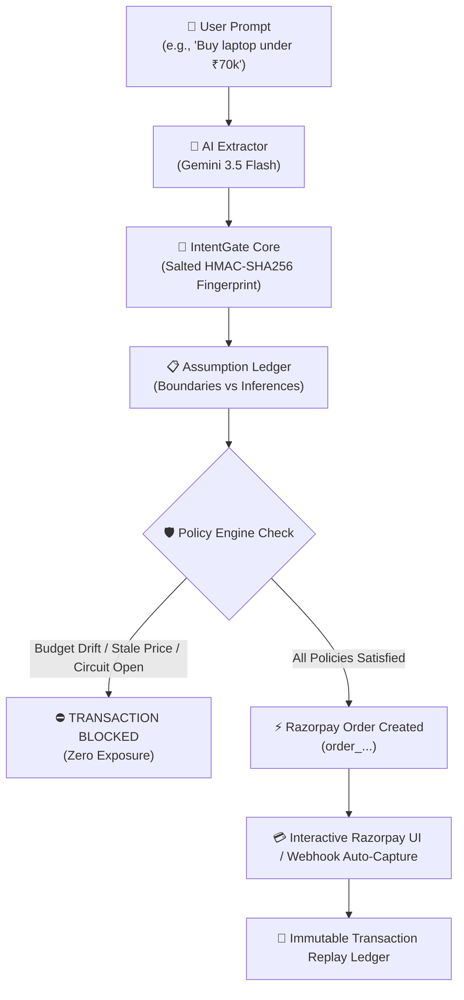

# 🛡️ IntentGate: Trust, Verification & Policy Infrastructure for Delegated AI Commerce

> **"LLMs propose. Policies constrain. APIs execute. Verification proves. Audit remembers."**

IntentGate is an autonomous payment verification & policy enforcement gateway built specifically for **Delegated AI Commerce**. As AI shopping assistants and autonomous agents take on financial authority, IntentGate acts as a cryptographic firewall between probabilistic LLM outputs and payment gateways like **Razorpay**.

---

## 💥 The Real-World Market Need & Problem Statement

As artificial intelligence shifts from passive advice to **autonomous execution** (where AI agents buy products, book subscriptions, and execute financial transactions on behalf of users), a severe trust gap emerges. Probabilistic LLM outputs are inherently non-deterministic and subject to hallucination, price drift, and prompt injection attacks.

Without an enforcement layer like **IntentGate**, autonomous AI commerce creates catastrophic real-world risks:

### 1. 💳 Consumer Credit Risk & Financial Distress (CIBIL Impact)
If an autonomous AI agent overspends beyond the user’s designated budget (e.g., purchasing a laptop at ₹85,000 when the user specified ₹70,000), and the user does not have sufficient bank balance, **the transaction bounces**. Repeated bounced transactions and overdrafts trigger bank penalties, damage banking relationships, and directly degrade the consumer's **CIBIL / Credit Score**.

### 2. ⚡ Payment Infrastructure Strain & Gateway Friction
Unchecked AI agent retry loops and unauthorized transaction attempts exponentially inflate payment processing traffic. Payment gateways (such as **Razorpay**) and issuing banks are forced to process massive volumes of unnecessary, failing, or bouncing transaction attempts, congesting financial pipelines and increasing fraud verification overhead.

### 3. ⚖️ Legal Liability & Brand Risk for AI Platform Companies
When an autonomous AI agent makes an unauthorized ₹15,000 overspend or purchases incorrect non-refundable goods, the consumer will hold the **AI startup or LLM provider legally accountable**. Ungoverned financial agency exposes AI companies to consumer lawsuits, regulatory intervention, refund disputes, and irreversible brand destruction.

---

## 🏛️ How IntentGate Solves It

IntentGate acts as an **immutable trust layer** that converts non-deterministic user prompts into cryptographically signed financial commitments. It enforces strict boundary policies *before* any money touches the **Razorpay API**.



---

## 🔥 Key Technical Features

### 1. 🔑 Salted HMAC-SHA256 Intent Fingerprinting
* Cryptographically binds the user's original intent (`category`, `max_budget`, `quantity`, `expiry`) to a canonical identity hash.
* Prevents prompt tampering, agent unauthorized modifications, or MITM payload altering.

### 2. 🧾 Dual Assumption Ledger
* **Explicit Constraints**: Enforced strictly as non-negotiable hard boundaries (e.g. `max_budget <= 70,000`).
* **Inferred Assumptions**: Tracked as advisory metadata (e.g. `preferred_ram: 16GB`, `preferred_os: Windows`), allowing the agent flexibility without breaching financial limits.

### 3. 🛡️ Multi-Layer Deterministic Policy Engine
* **Budget Drift Detection**: Rejects any proposed price higher than explicit user consent + policy threshold.
* **Category & Quantity Drift Verification**: Prevents product substitution tricks or unauthorized multi-unit buys.
* **Data Freshness Guard**: Queries merchant catalog timestamps to ensure price quotes haven't expired or been manipulated before checkout.

### 4. ⚡ Razorpay Live Test & Webhook Integration
* Programmatically creates authentic **Razorpay Orders** (`order_...`) via `razorpay-python` SDK using active Razorpay API Keys (`RAZORPAY_KEY_ID`, `RAZORPAY_KEY_SECRET`).
* Integrated with **Razorpay Standard Checkout Modal (`checkout.js`)** for interactive payment authorization.
* **Idempotent Webhook Reconciler**: Processes asynchronous payment capture webhooks (`payment.captured`) with HMAC signature verification (`RAZORPAY_WEBHOOK_SECRET`) to prevent duplicate charges.

### 5. 🔌 Redis-Backed Idempotency & Circuit Breakers
* **Idempotency Locking**: Prevents double-spending when agents retry network calls.
* **Distributed Circuit Breaker**: Automatically trips into `OPEN` state upon repeated upstream payment failures or merchant errors, shielding issuing banks and payment gateways from API spam.

### 6. 🧪 11-Scenario Chaos Lab Injection Engine
* Allows developers to simulate real-world failure modes in real time:
  * **Price Surge / Budget Drift**
  * **Stale Merchant Data Attack**
  * **Expired Intent Tokens**
  * **Duplicate Razorpay Webhook Events**
  * **Payment Gateway Timeouts & Auth Expiries**
  * **Merchant Account Suspensions**

### 7. 📜 Immutable Transaction Replay & Audit Timeline
* Detailed event-by-event timeline tracking every actor (`USER`, `AGENT`, `POLICY_ENGINE`, `RAZORPAY_SERVICE`, `RAZORPAY_WEBHOOK`) with complete rationale and audit metadata.

---

## 🛠️ Technology Stack

| Layer | Technologies |
| :--- | :--- |
| **Backend** | Python 3.12, FastAPI, SQLAlchemy (Async), SQLite / PostgreSQL, Pydantic v2 |
| **AI Extraction** | Google Gemini API (`gemini-3.5-flash`), Deterministic Regex Fallback |
| **Payment Gateway** | Razorpay Python SDK (`razorpay`), Razorpay Checkout JS, HMAC Signature Verification |
| **State & Caching** | Redis / Async In-Memory Redis Mock |
| **Frontend** | Next.js (App Router), TypeScript, TailwindCSS, Lucide Icons, Mermaid.js |

---

## 🚀 Quick Start Guide

### Prerequisites
* Python 3.10+
* Node.js 18+
* Active Razorpay API Test Keys (Key ID & Key Secret)

---

### 1. Backend Setup

```bash
# Navigate to backend directory
cd backend

# Create virtual environment
python -m venv venv

# Activate virtual environment
# On Windows:
venv\Scripts\activate
# On macOS/Linux:
source venv/bin/activate

# Install dependencies
pip install -r requirements.txt

# Create .env file in backend directory
cat <<EOT > .env
GEMINI_API_KEY=your_gemini_api_key_here
GEMINI_MODEL=gemini-3.5-flash

RAZORPAY_KEY_ID=rzp_test_your_key_id
RAZORPAY_KEY_SECRET=your_key_secret
RAZORPAY_WEBHOOK_SECRET=rzp_webhook_secret_key
EOT

# Seed database with sample passports & catalog data
python -m app.db.seed

# Start FastAPI backend server
uvicorn app.main:app --reload --port 8000
```

Backend API will be running at `http://localhost:8000`. Swagger API docs available at `http://localhost:8000/docs`.

---

### 2. Frontend Setup

```bash
# Open a new terminal and navigate to frontend directory
cd frontend

# Install npm dependencies
npm install

# Start Next.js development server
npm run dev
```

Frontend application will be running at `http://localhost:3000`.

---

## 🎮 Exploring the Dashboard

1. **Intent Firewall Pipeline**: Input natural language shopping prompts (e.g. *"Find me a programming laptop under ₹70,000"*). View extracted HMAC fingerprints, assumption ledgers, policy evaluation details, and click **`[ 💳 Open Razorpay Payment UI ]`** to trigger live Razorpay Checkout!
2. **Chaos Lab**: Toggle real-time failure scenarios (budget drift, stale data, duplicate webhooks) and observe how IntentGate blocks violations before payment execution.
3. **Transaction Replay**: Inspect step-by-step cryptographic audit logs of past transactions.
4. **Agent Passports & Reputation**: Monitor agent trust scores, spending limits, and historical drift compliance.

---

## 📄 License

Built for the **Razorpay Buildathon**. Distributed under the MIT License.
